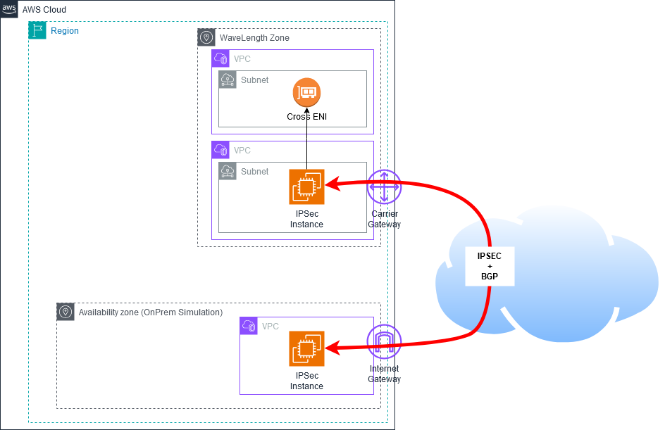

# AWS Wavelength IPSec BGP Infrastructure

> [!CAUTION]
> Project in progress

> [!WARNING]  
> ## ⚠️ Important Disclaimer
>
> **This project is for testing and demonstration purposes only.**
>
>Please be aware of the following:
>
>- The infrastructure deployed by this project is not intended for production use.
>- Security measures may not be comprehensive or up to date.
>- Performance and reliability have not been thoroughly tested at scale.
>- The project may not comply with all best practices or organizational standards.
>
>Before using any part of this project in a production environment:
>
>1. Thoroughly review and understand all code and configurations.
>2. Conduct a comprehensive security audit.
>3. Test extensively in a safe, isolated environment.
>4. Adapt and modify the code to meet your specific requirements and security standards.
>5. Ensure compliance with your organization's policies and any relevant regulations.
>
>The maintainers of this project are not responsible for any issues that may arise from the use of this code in production environments.

---

# AWS Wavelength IPSec BGP Infrastructure

> [!CAUTION]
> Project in progress

## Overview
This Terraform project enables direct VPN termination at the edge using AWS Wavelength Zones. By eliminating the need for traffic to traverse back to the parent AWS Region, this solution significantly reduces latency for edge computing applications.

We have build a dedicated Terraform module, to build an IPsec EC2 Instance, which can be deployed in a Region or in a Wavelength Zone. (No test done yet in a local zone and Outpost)




## Module IpsecInstance

More details here : 
[Module IpsecInstance](modules/ipsec-instance/)


### Key Benefits
- Direct VPN termination in Wavelength Zone
- Local traffic processing without regional backhaul
- Reduced network latency for edge applications
- Dynamic routing with BGP support
- Automated deployment using Terraform

### Ideal Use Cases
- Industrial IoT applications
- Real-time video processing
- Mobile gaming infrastructure
- Edge AI/ML workloads
- Connected vehicle applications

## Prerequisites
- AWS Account with Wavelength Zone access
- Terraform (version 0.12 or later)
- AWS CLI configured with appropriate credentials
- EC2 key pair
- Access to AWS Wavelength Zones

## Architecture Components

In this code, we are going to deploy 2 Ipsec instances : 
- The first on in an AWS region, to simulate an IPSec Router on premises
- The second one, in a Subnet in a Wavelength Zone.
  - In the example, we are attaching a second VPC to the instance, to provide connectivity to several subnets.

  Here you are the details of what is designed.

- VPC with Wavelength Zone extension
- Carrier Gateway for mobile network connectivity
- EC2-based VPN endpoint in Wavelength Zone
- IPSec tunneling with BGP routing
- Security groups and IAM roles
- Systems Manager integration

## Quick Start

### 1. Configure Backend
Create `s3.tfbackend` file:
```hcl
terraform {
  backend "s3" {
    bucket = "XXXXXXXXXXXXXXXX"
    key    = "terraform.tfstate"
    region = "us-east-1"
  }
}
```

### 2. Set Variables

Create terraform.tfvars:
```hcl
aws_region                  = "us-east-1"
availabilityzone_wavelength = "us-east-1-wl1-bos-wlz-1"
key_pair_name              = "wavelength-vpn-key"
bgp_asn                    = 65000
peer_ip                    = "198.51.100.1"
peer_asn                   = 65001

# Multi-VPC Configuration
enable_secondary_vpc       = true
secondary_vpc_cidr        = "192.168.0.0/23"
enable_transit_gateway    = false
enable_vpc_peering       = true
```
### 3.  Deploy Infrastructure
```bash
# Initialize Terraform
terraform init -backend-config=s3.tfbackend

# Review changes
terraform plan

# Apply configuration
terraform apply
```

#### Network Configuration

- Wavelength Zone
  - Primary VPC
    - CIDR: 10.0.0.0/16
    - Wavelength Zone Subnet: 10.0.1.0/24
    - IPSec VTI Interface: 169.254.0.1/30

  - Secondary VPC
    - CIDR: 192.168.0.0/23
    - Wavelength Zone Subnet: 192.168.0.0/24
    - Application Subnet: 192.168.1.0/24

- Regional VPC
  - CIDR: 10.100.0.0/16
  - Regional Subnet: 10.100.1.0/24

#### Security Features

- Systems Manager Session Manager for secure access
- Configured security groups for IPSec traffic
- IAM roles with least privilege principle
- Encrypted VPN tunnels
- Network ACLs for VPC isolation
- Security group rules for inter-VPC communication

## Troubleshooting
### General Connectivity
#### 1. Verify AWS credentials and permissions

#### 2. Check VPN tunnel status:

>sudo ipsec status

#### 3. Verify BGP sessions:

>sudo vtysh -c 'show ip bgp summary'

#### 4. Monitor CloudWatch logs for errors

## License

This project is licensed under the terms of the [LICENSE](LICENSE) file included in this repository.